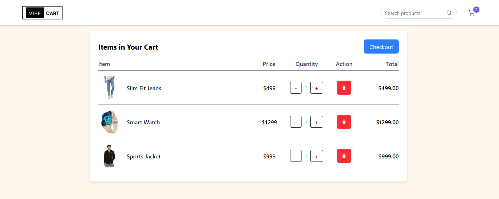
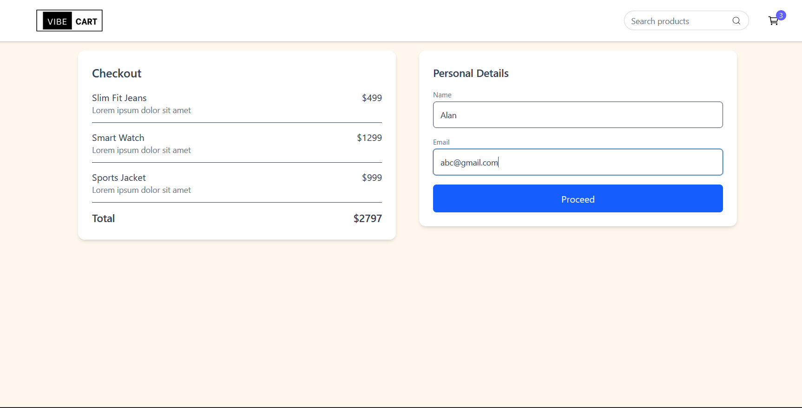
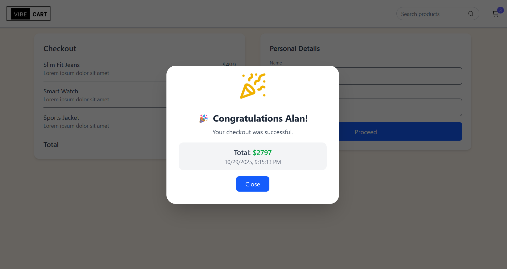

# 🛒 Ecom-Cart  
> **Ecom-Cart** is a full-stack e-commerce shopping cart application built with the **MERN (MongoDB, Express, React, Node.js)** stack.  
> It allows users to browse products, add them to their cart, and complete checkout seamlessly — all with real-time updates and clean UI built using **React + Vite**.

---

## 📚 Table of Contents
1. [Overview](#overview)
2. [Features](#features)
3. [Tech Stack](#tech-stack)
4. [Setup Instructions](#setup-instructions)
5. [Screenshots](#screenshots)


---

## 🧩 Overview
Ecom-Cart demonstrates a modular, scalable e-commerce setup:  
- The **backend** handles APIs for products, carts, and checkout.  
- The **frontend** offers a simple, fast, and responsive shopping experience.  
- The project integrates RESTful APIs, error handling, and dynamic state management via context.  

---

## ✨ Features
### 🛍️ User Features
- 🧾 View all products in a responsive grid  
- 🛒 Add or remove items from the cart  
- 💳 Proceed through checkout  
- 🧮 Automatic cart total calculation  
- ❌ Error handling for unavailable products  

### ⚙️ System Features
- 🚀 RESTful API with Express.js  
- 🧱 MongoDB for data storage  
- 🧩 Modular MVC architecture  
- 🧰 Error handling middleware  
- ⚡ Fast frontend with React & Vite  
- 🧭 Context API for global state management  

---

## 🧰 Tech Stack

### Frontend
- ⚛️ **React (Vite)**
- 🧭 **React Router**
- 💅 **CSS / Tailwind CSS**
- 🔄 **Context API**
- 📦 **Axios** for API requests

### Backend
- 🟢 **Node.js / Express.js**
- 🍃 **MongoDB + Mongoose**
- ⚙️ **Express Middleware**
- 🧰 **Custom Error Handlers**
- 🧩 **Async/Await Error Handling**
- 📤 **Seeder Script** for populating database


---

## ⚙️ Setup Instructions

### 1️⃣ Clone the repository
```bash
git clone https://github.com/rajat-sharma-3745/ecom-cart.git
cd ecom-cart
```
 ## 2️⃣ Backend setup
 ```bash
cd backend
npm install
node seeder.js // Run the database seeder
```
3️⃣ Frontend setup
```bash
cd ../frontend
npm install
npm run dev
```

## Demo & Screenshots

Below are a few screenshots from the live deployed site:

<!-- Replace these with your actual images from your `/assets` or `screenshots` folder -->
  
  
  
  

---


